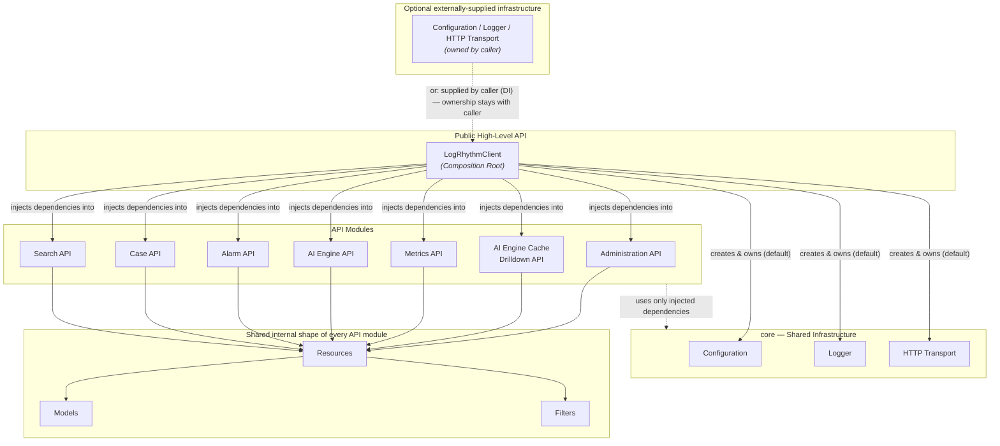

# Component Model

> **Status of this document:** target architecture, largely not implemented. This
> diagram describes the intended component structure of the SDK, consistent with
> [Architecture Overview](overview.md). None of the components drawn below have a
> runtime implementation yet. The SDK's exception hierarchy (SPEC-007) is
> implemented (`logrhythm_sdk.core.exceptions`, exported via
> `logrhythm_sdk.exceptions`), but — like `Redaction` (see
> [SPEC-005](../specifications/transport.md#redaction)) — is not itself drawn as a
> node here; this diagram is a high-level sketch, not an exhaustive enumeration of
> every `core` utility.

## Purpose

This diagram gives a component-level view of the planned SDK: which components exist,
who owns whom, and how dependencies flow. It intentionally stops at components — no
classes, methods, attributes, or other implementation detail. See
[Design Principles](../specifications/design-principles.md) for the rules that shape
these relationships, and [Design Specifications](../specifications/README.md) for
where the "how" of an individual component will eventually be documented.

## Diagram

**Reading the diagram:**

- `Resources`, `Models`, and `Filters` are drawn once to represent a **repeated
  shape**, not shared instances. Each API module owns its own `Resources`, `Models`,
  and `Filters` — the diagram would otherwise need seven parallel copies of the same
  three boxes.
- Solid arrows from `LogRhythmClient` express creation/ownership and dependency
  injection. The two dashed arrows express two different things: the one from
  `APIModules` to `Core` means read-only use of already-injected dependencies —
  never creation; the one from `ExternalInfra` to `Client` means the alternative
  path where a caller supplies `Configuration`, `Logger`, or `HTTP Transport`
  instead of `LogRhythmClient` creating its own.

## What this diagram makes explicit

**`LogRhythmClient`:**

- is the public, high-level entry point to the SDK.
- is the **composition root**: the one place where the object graph is assembled.
- holds the resolved configuration.
- **either creates the shared components (`Configuration`, `Logger`, `HTTP
  Transport`) itself, or accepts them from the caller via dependency injection** —
  both are valid ways to obtain them.
- holds references to those shared components for as long as the client is alive,
  regardless of which path provided them.
- injects the shared components into each API module.
- **owns and manages the lifecycle only of the shared components it created
  itself** (for example, closing an internally created HTTP transport when the
  client itself is closed). Components supplied externally by the caller remain
  owned by the caller: `LogRhythmClient` uses them but never creates, closes, or
  otherwise manages their lifecycle.

**API clients (Administration, AI Engine Cache Drilldown, Metrics, AI Engine,
Alarm, Case, Search — see
[SPEC-010, Supported APIs](../specifications/api-modules.md#supported-apis)):**

- own no infrastructure of their own.
- never configure a logger themselves.
- never construct an HTTP client themselves.
- depend exclusively on what `LogRhythmClient` injects into them.

## Non-goals of this diagram

- It does not define class names, method signatures, or attributes.
- It does not define the configuration file format, transport library, or logging
  format — those are separate, future design specifications.
- It does not imply that any of these components currently exist in code.
